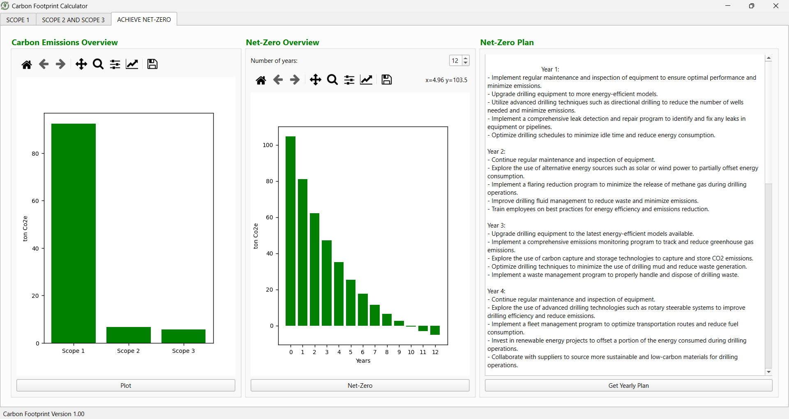
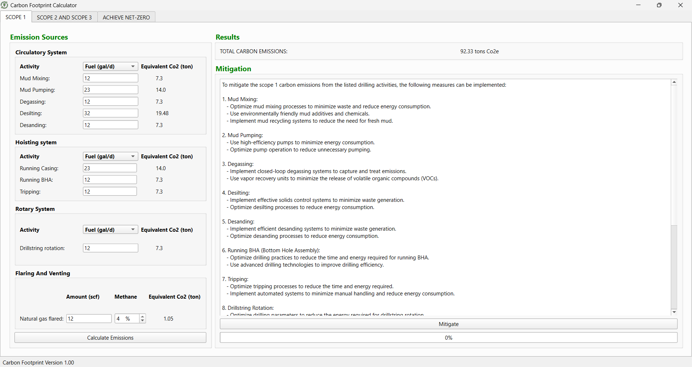

# Carbon Footprint Calculator 🌍

A desktop application that estimates carbon emissions from oilfield drilling projects. Built with PyQt6, this tool enables users to calculate, visualize, and mitigate Scope 1–3 emissions with a user-friendly interface. It integrates the OpenAI GPT API for generating actionable reduction plans and uses Matplotlib for dynamic plotting of emission trends and net-zero targets.

## 🔍 Features

Scope 1, 2, and 3 Emissions Input – Enter detailed fuel and flaring data for different drilling systems.

Real-Time Visualization – Bar charts showing current emissions and projected net-zero paths using Matplotlib.

GPT Integration – Automatically generate strategic net-zero mitigation plans via OpenAI’s GPT API.

Drill-Specific Metrics – Customize inputs for circulatory, hoisting, rotary, and flaring systems.

Net-Zero Timeline – Interactive chart showing how emissions decline over time with applied strategies.

## 🖼 Screenshots

 

## 🛠 Tech Stack

Python 3

PyQt6 – For the GUI interface

Matplotlib – For data visualization

NumPy – For data processing

OpenAI API – For GPT-powered recommendations

## Author

- **Kelvin Addy**

## Acknowledgments

- I would like to thank [Joshua Willamn](https://github.com/joshuawillman), Author of Beginning-PyQt--second-edition, without his detailed explanation of PyQt6, i wouldn't have been able to get started on this project.

[NOTE] This project is not yet complete, i will be adding more features in the future. If you notice any bugs or additions you may want to add, feel free to contribute.

## How to Contribute

1. Make sure you have a GitHub account.
2. Fork the repository
3. Create a new branch on which to make your change, e.g.
   `git checkout -b my_contribution`
4. Commit your change. Include a commit message describing the correction. Please note that if your commit message is not clear, the correction will not be accepted.
5. Submit a pull request.

Thank you for your contribution!
